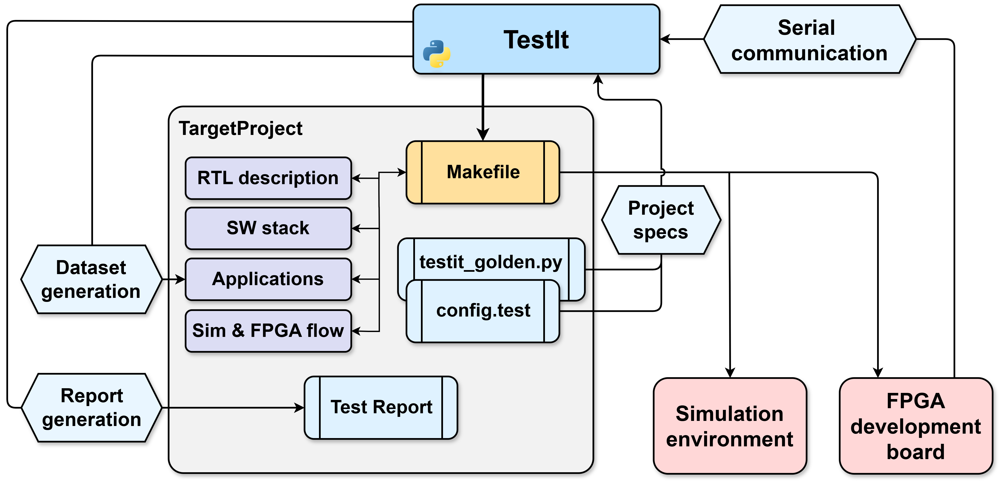

# Just TestIt!

TestIt is a python package designed to **automate full-system integration testing** using a **Software-Based Self-Test (SBST)** approach.
While formal verification methods are highly effective for targeting individual components, their complexity grows exponentially with the size of the System-Under-Test (SUT), making them impractical for testing large scale systems, like MCUs.
Furthermore, they do not test interactions between the hardware platform and the software stack, which is essential for validating real-world functionality.
Last but not least, they are limited to simulated environments, with all their limitations. 

TestIt tackles these limitations and aims at **bridging the gap** between **formal verification** and **real-world applications**.

#### In short, what can TestIt do?
- Automate **generation** of **random datasets** and **reference values**, according to your specifications.
- Automate **building** of simulation **models** and synthesis for FPGA.
- Automate **compilation** of SW application, which take advantage of the datasets it generates.
- Automate **execution of tests**, both in simulation environments and using FPGAs, which greatly speed up the test time (up to **x11 times reduction**).
- Characterize the **real-world performance** of your system.

#### How can TestIt do all of this? 
With just three requirements:
- A simple **configuration file**, `config.test`, in which you have to describe both *your workflow* and the *tests* you want to run.
- A **python module**, `testit_golden.py`, in which you can develop the *golden functions* used to generate the reference values for your test.
- A complete **Makefile-based workflow**, with some custom targets, as described below. This is the *gateway* that TestIt uses to access your workflow to build, compile and load.

#### How can you use TestIt?
Again, it's super simple! Just follow this documentation and you'll find plenty of useful tips to integrate TestIt into your project.
If you have any questions or suggestions, don’t hesitate to reach out to Tommaso Terzano at tommaso.terzano@gmail.com. He's always happy to help clear up any doubts you might have.

> ⚠️ Take every "**must do**" with the utmost seriousness, as not following those advices will break TestIt. In Italy we say "_Uomo avvisato mezzo salvato_"...

## Installation

Simply run the following command in your bash terminal:

```bash
pip install testitpy
```

That's it!

## Common Q&A

<div style="text-align: center;">
    
</div>
<p  align="center"><b>Figure 1</b>: Structure of a TestIt environment </p>

In order to run TestIt and take full advantage of its features, it's important to get to know how it works. This section answers many of the questions you might have.

- **How does TestIt interact with my RTL project?**
  TestIt uses Make as a gateway to tap into your RTL project's workflow. We considered several approaches, but chose Make because it’s the most popular scripting tool in open-source RTL projects. And if your project doesn’t already use a Makefile, don’t worry, Make is so flexible and simple that you can easily integrate it into your workflow. Just note that TestIt does require you to add a few standardized targets to your Makefile.
  Check out section xx for more details and examples.
  
- **What does Software-Based Self-Test mean?**  
  _SBST_ is a testing approach where software applications (_Software-Based_) run directly on your target system to verify specific units, without needing any external equipment (_Self-Test_). Essentially, the application checks its own functionality for you.

  For example, imagine you want to test a Systolic Array (SA) integrated into your custom MCU. With SBST, you'd write an application that performs a matrix multiplication using your SA. This application then compares the SA's result with a reference value (i.e., the expected result of the multiplication). And that’s SBST in a nutshell!

  Now, to set up a realistic test campaign, you'd typically need to generate hundreds of input matrices, compute their expected results, compile your software, run it on simulation or FPGA, read and store the outputs, and then repeat the process. With TestIt, you can streamline all of this with a single command:  

  ```bash
  testit run
  ```

  Pretty neat, right?

- **How can TestIt generate random input datasets?**  
  TestIt creates a unique dataset for every test iteration based on your specifications in the _test_ field of `config.test`. There, you define the size, dimensions, and data type for your input dataset(s). Plus, you can even **parameterize** dataset features!  
  Following the SBST approach, TestIt writes these input datasets, along with any parameters and reference values—to C source and header files in the directory specified in the _test_ field of `config.test`. This way, everything is automated and ready for your test campaign.

- **How can TestIt input datasets be parametrized?**
  When specifying the test you want TestIt to run, include a parameters field in your configuration (see section xxx for details). In this field, you can describe as many parameters as you need by assigning each a name and a value. Optionally, you can also provide a value range and a step size.

  TestIt scans your input dataset specifications for strings that match any of the defined parameters. When a match is found, it replaces that string with the current parameter value, allowing your input datasets to dynamically change shape with each iteration. 
  Additionally, these parameters are passed to the golden function defined in `testit_golden.py`, so your function can use them as needed. 
  Finally, all parameters are declared in the header file generated by TestIt in the directory specified in the test field, making them accessible to your test application.

  For example, you might set a *TILE_SIZE* parameter to experiment with different tiling strategies for your SA, or define an *ARRAY_LEN* parameter with a range and a step to vary the array size with each iteration. Imagination is the only limit!

- **What should the golden function(s) look like?**
  Pro tip: when you run `testit setup`, TestIt will generate fully commented template files for both `config.test` and `testit_golden.py`, ready to be modified and tailored to your project.

  There are just a couple of requirements for your golden functions. First of all, they **must** accept two arguments: *input_datasets* and *parameters*, which TestIt passes as lists. The only other requirement is that your function **must** return a _one-dimensional list_. If your output is a tensor, simply flatten it. Everything else in your function is completely up to you.

- **How can TestIt read the result(s) of my application(s)?**
  TestIt relies on a regular expression mechanism, meaning your test application **must** print its output, whether via a serial connection or a file dump in simulation environments, using the regex you define in the _test_ field of `config.test`. You can make this regex as elaborate as needed, but remember to include tags for each field.

  Your application is free to print multiple regex strings, provided they follow the same structure. This setup allows a single test application to run as many sub-tests as you want, offering significant flexibility. For example, you can leverage this feature for **performance characterization**. As explained in section zzz, your application could record test durations using an on-board timer and then report those timings within the regex, which are then communicated back to the host device.

  One critical requirement is that your application **must** signal when an iteration is complete. This is easily accomplished by printing a **"&"** character, which TestIt’s serial thread interprets as an end-of-communication signal.
 
## Functional Description

This section covers every aspect and feature of TestIt. If the previous section didn't answer all your doubts, this one will. 
Let's get technical!

### Requirements

This section covers all the requirements that TestIt needs to run a successful integration test.

#### Configure the testing environment: *config.test*

This file is at heart a JSON database, which contains all the information that TestIt needs to operate, about both your workflow and the tests you want to run.
Specifically, there are three fields that you need to fill out:

- **target**

  ```json
  {
    name: "pynq-z2"
    type: "fpga"
    usbPort: 2 
    baudrate: 9600
    iterations: 10
    outputFile: "path/to/sim/dump"
  }
  ```
  This field captures all the details about the target platform you are using, which can be any FPGA development board or simulation tool that *your workflow* supports.
  
  - __*name*__: You can choose any name you like. Keep in mind, this name will be passed as an argument to almost every TestIt-related Makefile target, so structure your Makefile accordingly.

  - __*type*__: This **must be** either **fpga** or **sim**. Don't worry, TestIt checks all parameters that requires some fixed values, so if you get this wrong, it will tell you.

  - __*usbPort*__: This is quite is straightforward, it specifies the USB port number to use.

  - __*baudrate*__: Similarly, this parameter defines the communication speed. There isn’t much more to add here.

  - __*iterations*__: This is a key parameter. By default, TestIt repeats the defined tests for the number of iterations specified with this parameter. In each iteration, the tool selects random parameters (if available) and generates a corresponding input dataset and reference values. Note that this value can be overridden when using [sweep mode](#sweep-mode).

  - __*outputFile*__: This parameter may seem a bit tricky. TestIt reads test results via serial communication between the host device and the system under test (SUT). This method is used even for simulation-based tests. Essentially, your simulation system needs to dump the serial communication data to a file, and TestIt then reads and parses this file to extract the test information. The _outputFile_ parameter specifies the directory containing this file.

- <a id="report-dir"> **report**</a>
  ```json
  {
    dir: "path/to/report/folder"
  }
  ```
  This field simply specifies the directory where TestIt will store the test results and generate the report when you run the `testit report` [command](#run-the-testing-campaign).

- **test**
  ```json
  [
    {
      appName: "application_name"
      dir: "path/to/app"
      genFilesName: "test_data"
      outputFormat: "(\\d+):(\\d+):(\\d+)" 
      outputTags: ["TestID", "Cycles", "Outcome"]

      parameters: [
        {
          name: "SIZE"
          value: [4, 10]
          step: 2
        }
      ]

      inputDataset: [
        { 
          name: "input_matrix_A"
          dataType: "uint8_t"
          valueRange: [0, 255]
          dimensions: ["SIZE", "SIZE"]
        }
        { 
          name: "input_matrix_B"
          dataType: "uint8_t"
          valueRange: [0, 255]
          dimensions: ["SIZE", "SIZE"]
        }
      ]

      outputDataset: [
        { 
          name: "output_matrix"
          dataType: "uint8_t"
        }
      ]

      goldenResultFunction: {
        name: "matmul"
      }
    }
  ]
  ```
  This field describes all the tests you want TestIt to run. In the example above, there’s only a single test, but notice that it’s actually a list (hence the square brackets), so feel free to add as many tests as you desires. Let’s break this down piece by piece:
<br>

  First of all, you need to specify some __details__ about the test:
  - __*appName*__: This is crucial because it’s passed to the Make targets for compiling the test application. Make sure you match the name your own workflow expects.
  - __*dir*__: This simply points to the directory where your test application lives.
  - __*genFilesName*__: This is the name for the C source and header files that TestIt will generate to store random datasets, reference values, and parameters. Your test application should link the header so it can access all this data, so be sure to use the right name.
  - __*outputFormat*__: Super important! This is the _regular expression_ that TestIt will use to parse the results from your test application. It’s important to ensure your application prints data in the same format.
  - <a id="output-tags"> __*outputTags*__</a>: Again, super important! These are the tags associated with the fields in the regex. Each tag corresponds to a capture group in the regular expression.
  <br>

  The next step is to define __parameters__, which are essential for TestIt’s functionality but not strictly required. This field is also a _list_, so feel free to define multiple parameters per test.

  Each parameter __must__ have:
  - __*name*__: This is the name that TestIt will include in the generated header file, so make sure your test application is ready to use it.
  - __*value*__: This can be a _fixed value_, a _fixed string_, or a _value range_. If it’s a value range (like in the example), TestIt will pick one value from that range in each iteration. And if any dimensions of your input dataset (like "input_matrix_A" or "input_matrix_B") depend on this parameter, TestIt will parse the correct parameter value for every matching dimension.
  
  If the value is defined as a range, it’s _possible_ to define a **step** parameter (as shown in the example). This parameter is used by TestIt whenever you run your tests in sweep mode, by calling `testit run --sweep`.
  In sweep mode, TestIt cycles through every possible **parameter combination**, effectively overriding the **iterations** parameter you set in the **target** field.
  <br>

  Next on the list: __input datasets__. Just like parameters, this field is a _list_, so you can define as many input datasets as you wish.

  Each input dataset **must** have:
  - **_name_**: This is the name TestIt will give to the C array it writes in the source and header files. Make sure your test application knows this name.
  - **_dataType_**: A _string_ used to define the C array that holds the dataset values. TestIt checks that this is a standard C type, as for the moment custom datatypes aren’t supported yet.
  - **_valueRange_**: The range from which TestIt picks values to create the random dataset. Make sure this range suits the chosen data type.
  - **_dimensions_**: A _list_ describing the dataset’s dimensions. If a dimension corresponds to a _parameter_, TestIt will parse the correct value automatically. You can have as many dimensions as you like!
  <br>

  Next up is a straightforward step: defining the __output datasets__. They only have a couple of fields, as output size and dimensions are extracted by TestIt from the array that your golden function returns:

  - **_name_**: Just like for input datasets, this is the name TestIt will assign to the C array it writes in the source and header files. Make sure your test application looks for this name.
  - **_dataType_**: Similar to the input datasets, this _string_ determines the C array’s type. TestIt validates that it’s a standard C type; custom datatypes aren’t supported yet.
  <br>

  Speaking of golden functions, the __goldenResultFunction__ is the very last step in defining the _test_ field.

  - **_name_**: This is the name of the function TestIt will call to generate the reference dataset. It **must** match exactly the name you used for your function in `testit_golden.py`.
  

#### Define the golden functions: *testit_golden.py*

This file is quite simply a collection of all the functions that your test camapign will need to generate reference values. The functions declared in file will be dynamically imported by TestIt at execution time, just by looking for the name included in the _goldenResultFunction_ field in `config.test`. You can include any package you need in this file, so be free to experiment with it and taylor this Python module to your needs.

The only critical aspect you need to take into account is the nature of the arguments and return value of the function, which **must** be:
- **input_dataset** -> **list of numpy arrays**
- **parameters** -> **list of dictionaries**
- **return value** -> **list of numpy arrays**

This section will guide you through a couple of example functions, a simple one and a more complex one, that you can use as a reference to build your own function. 

The first one is the _workhorse of machine learning_, the __matrix multiplication__. When calling the [command](#setup-the-environment) `testit setup`, TestIt will include this very function in the template `testit_golden.py` that it will generate.
Let's analyze this function!

```python
def matrix_multiply(inputs: list, parameters: list) -> list:
    """
    Multiplies two NumPy matrices and returns the result.

    :param inputs: Randomly generated datasets (List of Numpy Arrays)
    :param parameters: Parameters (Dict)
    :return: Resulting Golden Datasets (List of Numpy Arrays)
    """
    matrix_A = inputs[0]
    matrix_B = inputs[1]

    # Check if multiplication is valid
    if matrix_A.shape[1] != matrix_B.shape[0]:  
        raise ValueError("Matrix dimensions do not match for multiplication!")

    result = np.matmul(matrix_A, matrix_A)

    return [result]
```

This simple function extracts two NumPy matrices from the list that TestIt generates, checks if they have compatible shapes, and multiplies them. If the dimensions don’t match, it raises an error to keep you informed. Notice how it returns the result as a single-element list, this is exactly what TestIt expects from a golden function.

The following function is a more complex example of what it's possible to achieve with TestIt. It performs the __im2col reshaping transformation__, which enables to compute _convolutions_ as a single __matrix multipication__. Here it is:

```python
def im2col_function(inputs, parameters):
    inputs = np.array(inputs)

    # Extract parameters
    batch_size = next(item['value'] for item in parameters if item['name'] == 'BATCH') 
    channels = next(item['value'] for item in parameters if item['name'] == 'CH')
    image_height = next(item['value'] for item in parameters if item['name'] == 'IH')
    image_width = next(item['value'] for item in parameters if item['name'] == 'IW')
    top_pad = next(item['value'] for item in parameters if item['name'] == 'TOP_PAD')
    bottom_pad = next(item['value'] for item in parameters if item['name'] == 'BOTTOM_PAD')
    left_pad = next(item['value'] for item in parameters if item['name'] == 'LEFT_PAD')
    right_pad = next(item['value'] for item in parameters if item['name'] == 'RIGHT_PAD')
    stride_d1 = next(item['value'] for item in parameters if item['name'] == 'STRIDE_D1')
    stride_d2 = next(item['value'] for item in parameters if item['name'] == 'STRIDE_D2')
    (filter_height, filter_width) = (next(item['value'] for item in parameters if item['name'] == 'FH'), next(item['value'] for item in parameters if item['name'] == 'FW'))
    kernel_size = (filter_height, filter_width)

    # Convert the input array into a PyTorch tensor with the correct shape
    input_tensor = torch.tensor(inputs).view(batch_size, channels, image_height, image_width)

    dilation = 1
    # Ensure kernel_size, stride, padding, and dilation are tuples
    if isinstance(kernel_size, int):
        kernel_size = (kernel_size, kernel_size)
    if isinstance(dilation, int):
        dilation = (dilation, dilation)

    # Adjust padding format for F.pad (expects pad_left, pad_right, pad_top, pad_bottom)
    padding_format = (left_pad, right_pad, top_pad, bottom_pad)

    # Apply zero padding
    padded_input = F.pad(input_tensor, padding_format, "constant", 0)

    # Unfold the padded input tensor
    unfolded = padded_input.unfold(2, kernel_size[0], stride_d2).unfold(3, kernel_size[1], stride_d1)
    unfolded = unfolded.permute(0, 2, 3, 1, 4, 5)

    # Reshape to get the 2D tensor where each row is a flattened receptive field
    channel_dim = padded_input.size(1)
    unfolded_tensor = unfolded.contiguous().view(-1, channel_dim * kernel_size[0] * kernel_size[1]).t()

    # Convert the PyTorch tensor to a NumPy array and then to a list (simple array)
    unfolded_array = unfolded_tensor.numpy()
    unfolded_array = [unfolded_array.reshape(*unfolded_array.shape)]

    return unfolded_array
```

The interesting thing about this example is how it's possible to use parameters generated by TestIt to perform complex computations. In this case, TestIt generates a multitude of parameters, that define the input tensor shape (_BATCH_, _CH_, _IW_ and _IH_) and the filter shape (_FW_ and _FH_), as well as padding parameters and strides.
Since parameters are passed as a _list of dictonaries_, it's necessary to find the correct dictonary, i.e. the parameter wanted, and then extract its value. This is the best way we found, but you're welcome to try and find better ways. For example, you could write a simple function, _getParameter()_, in the same *testit_golden.py* or even in a separate module.

## Commands  

TestIt provides three main commands to access its functionalities.  

---

### **Setup the environment**  
```bash
testit setup
```  
This is the first command you’ll want to run. It does exactly what it says—it sets up your TestIt environment. Running this command generates template versions of *testit_golden.py* and *config.test*, based on the targets and examples in this documentation.  

You don’t have to place these files in the root of your RTL project, but keep in mind that **all subsequent TestIt commands must be executed in the same directory where you first ran** `testit setup`. That’s where TestIt expects to find its configuration files.  

---

### **Run the testing campaign**  
```bash
testit run [flags]
```  
This is the core command of TestIt, the one that actually executes the testing campaign. As mentioned earlier, you must run it in the directory where *testit_golden.py* and *config.test* are stored, which doesn’t necessarily have to be the root of your RTL project.  

You can customize the test campaign with the following flags:  

```bash
testit run --nobuild
```  
If you have already built your simulation or FPGA model and want to skip the build step, this flag will prevent TestIt from rebuilding it.  

```bash
testit run --sweep
```  
This enables <a id="sweep-mode">**sweep mode**</a>, which overrides the _iterations_ parameter and instead tests all possible parameter combinations for each individual test. This mode ensures a more comprehensive testing effort and is particularly useful for **performance characterization**. Be aware that this may generate a _large number of iterations_. The command line interface will always display the current iteration count and provide a dynamic estimate of the total test duration.  

```bash
testit run --mammamia
```  
Use this flag to let your test campaign cook like an Italian nonna would.  

---

### **Generate a test report**  
```bash
testit report [flags]
```  
This command generates a report of your most recent test campaign, displaying it in your terminal and saving it as `report.rpt` in the [directory](#report-dir) specified in `config.test`.  

> ⚠️ Every time you run `testit run`, the previous test campaign data is erased! If you need to keep it, make sure to back it up somewhere else.  

There are a couple of options to customize your report:  

```bash
testit report --sort_key [key_name]
```  
This sorts the test results based on any of the [output tags](#output-tags) defined in `config.test`. If you want to sort the results in descending order, add `--descending` to the command. Otherwise, sorting will be in ascending order.

---

